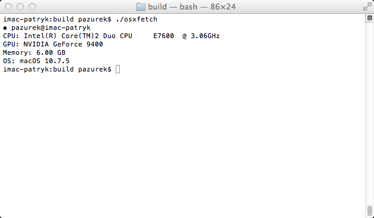

# osxfetch



A lightweight, neofetch-like CLI tool for displaying system information on macOS. Works across Mac OS X 10.5 through modern versions, with support for both Intel and Apple Silicon architectures.

## Features

- **Minimal Dependencies**: Pure C implementation using only macOS system frameworks
- **Cross-Architecture Support**: 
  - Apple Silicon (arm64)
  - Intel 64-bit (x86_64)
  - Intel 32-bit (i386)
  - PowerPC
- **System Information Display**:
  - Username & hostname
  - CPU model
  - GPU information
  - Memory
  - macOS version

## Installation

### Build from Source
Requires standard macOS developer tools (Xcode Command Line Tools).
```bash
git clone https://github.com/smartfrigde/osxfetch.git
cd osxfetch
make
```

The binary will be built and executed automatically. To build without running:

```bash
make build/osxfetch
```

### Build for Specific Architecture

```bash
# Apple Silicon
make arm64

# Intel 64-bit
make intel

# Intel 32-bit
make intel32

# Universal Intel (i386 + x86_64)
make universal-intel

# PowerPC
make ppc
```

## Usage

Simply run the binary:

```bash
./build/osxfetch
```


## License

See LICENSE file for details.
